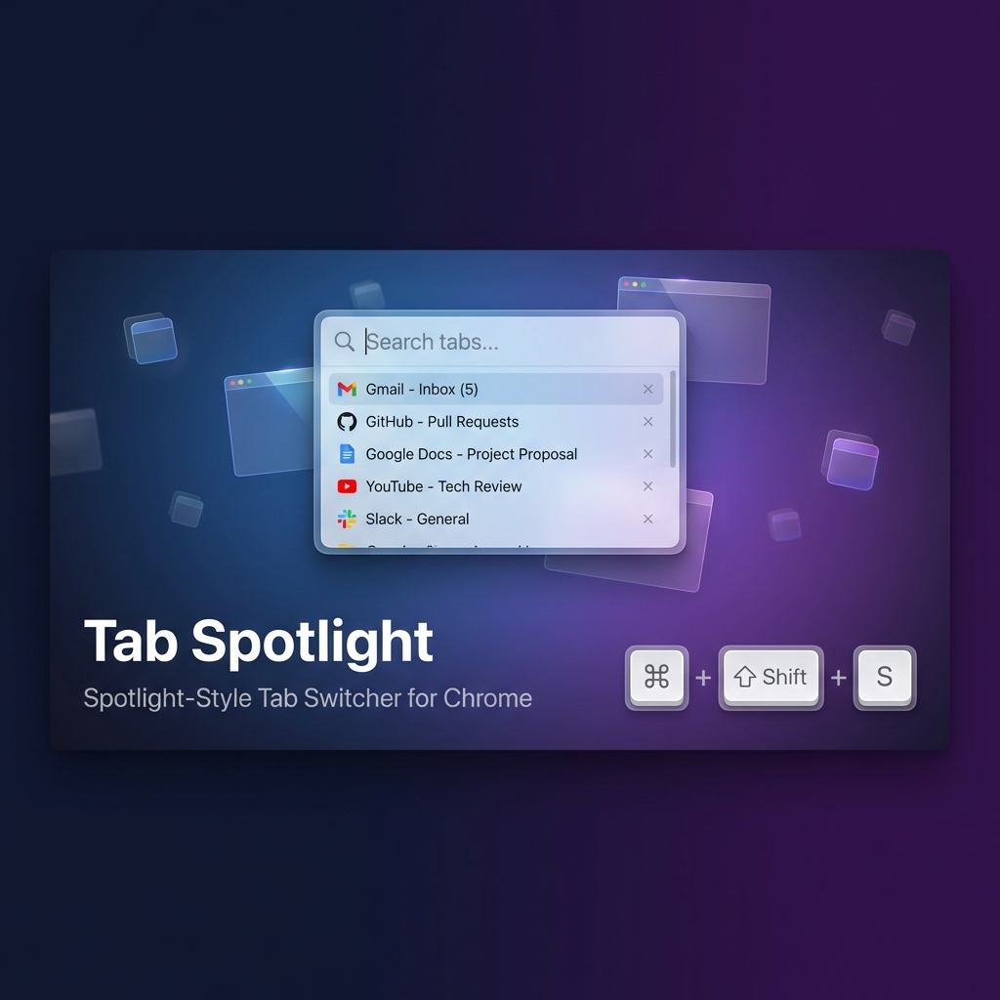
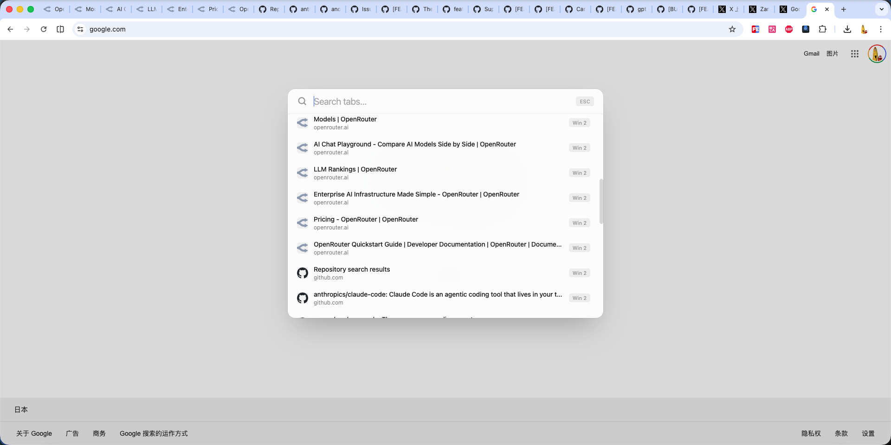
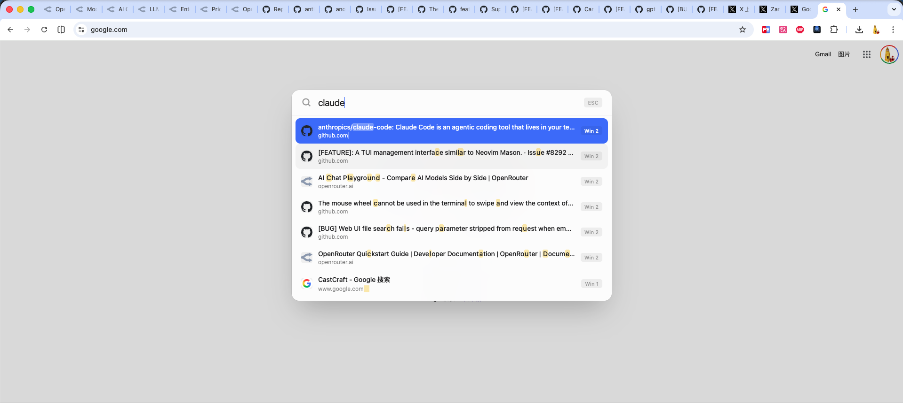
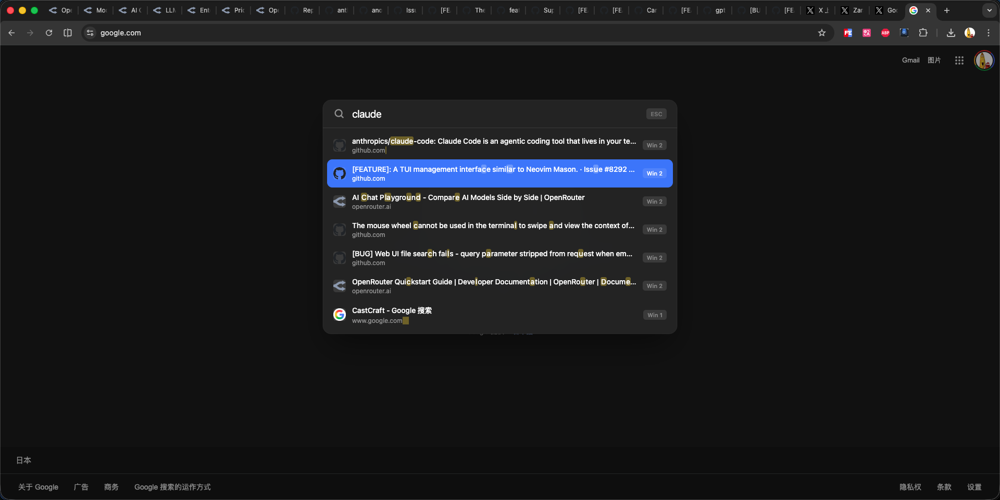

# Tab Spotlight

[中文版](README_zh.md)

**Tab Spotlight** is a Spotlight-style tab switcher for Chrome. Designed for keyboard-first usage to quickly find and switch between your browser tabs.



## ✨ Features

- 🚀 **Instant Search** – Find any tab by title or URL with fuzzy matching
- ⌨️ **Keyboard First** – Designed for speed, no mouse needed  
- 🎨 **Beautiful UI** – Clean, minimal design that adapts to your system theme
- 🌗 **Light & Dark Mode** – Automatically matches your system preference

## 📸 Screenshots

### Light Mode


### Search with Highlighting


### Dark Mode


## ⌨️ Keyboard Shortcuts

| Action | Mac | Windows/Linux |
|--------|-----|---------------|
| Open Tab Spotlight | `⌘` + `Shift` + `S` | `Ctrl` + `Shift` + `S` |
| Navigate results | `↑` / `↓` | `↑` / `↓` |
| Switch to tab | `Enter` | `Enter` |
| Close overlay | `Esc` | `Esc` |
| Close selected tab | `⌘` + `W` | `Ctrl` + `W` |

## 📦 Installation

### From Chrome Web Store
*(Coming soon)*

### Developer Mode
1. Download or clone this repository
2. Open Chrome and go to `chrome://extensions/`
3. Enable **"Developer mode"** in the top right corner
4. Click **"Load unpacked"**
5. Select the folder containing this project

## 🚀 Release & Packaging

This project includes an automated packaging script to generate the `.zip` file for Chrome Web Store publishing.

```bash
# Navigate to project directory
cd /path/to/TabSpotlight

# Run the release script
./release.sh
```

> **Note**: If you encounter permission issues, run `chmod +x release.sh` first.

The script generates `TabSpotlight.zip` ready for upload to Chrome Web Store.

## 🔒 Privacy

Tab Spotlight works entirely locally. **No data is collected or sent anywhere.**

👉 [View Full Privacy Policy](PRIVACY.md)

## 📄 License

MIT License
